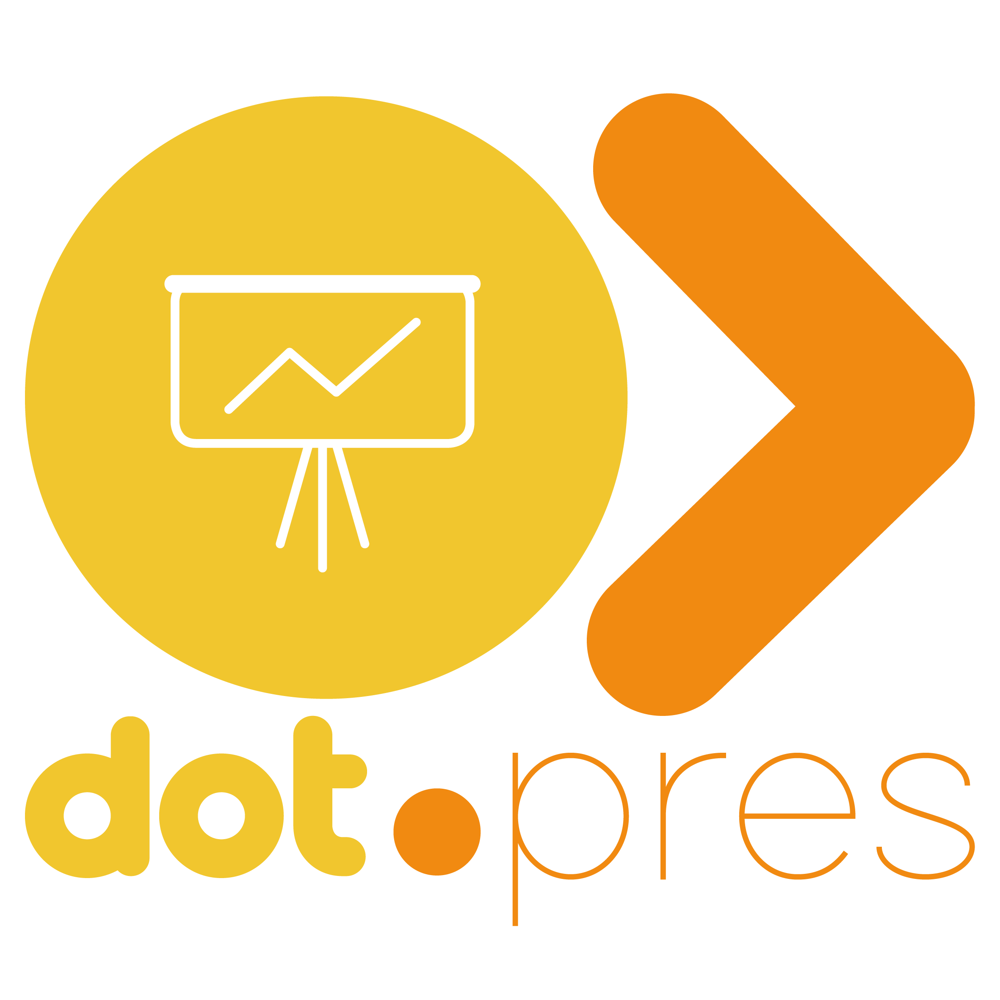

<div align="center">
  
  <h1>Dot.Press</h1>
  <p><strong>Canvas-first presentation builder with AI generation, real-time collaboration, and one-click export.</strong></p>

  
  
  
  
  
  
  
</div>

---

## Overview

Dot.Press is a full-stack web application that lets individuals and teams design, collaborate on, and present slides directly in the browser. It is built on a **Laravel 13 + Vue 3 + Inertia.js** stack with a **Konva.js** canvas engine at its core — no Flash, no iframes, no third-party slide hosts.

Key highlights:

- **Pixel-perfect canvas editor** — drag, resize, rotate, snap, and layer elements on a 1280 × 720 stage
- **Tiptap rich-text** — inline font, colour, alignment, and list controls without leaving the canvas
- **Claude-powered AI** — generate a full slide from a prompt, or rewrite selected text in seconds
- **Real-time presence** — see teammates' live cursors and who is editing which slide
- **Conflict-safe saves** — optimistic concurrency with revision numbers prevents lost edits
- **PDF & PPTX export** — one-click downloads powered by dompdf and PhpPresentation
- **Fullscreen presentation mode** — keyboard-navigable, Fullscreen API, Home / End / F shortcuts
- **Teams & multi-user** — Jetstream-powered team management with roles, invitations, and shared projects
- **Secure by default** — per-resource policies, CSRF via Sanctum + Inertia, signed asset URLs, MIME allowlist on uploads, and per-user rate limiting on AI and export routes

---

## Table of Contents

- [Tech Stack](#tech-stack)
- [Features](#features)
- [Architecture](#architecture)
- [Requirements](#requirements)
- [Quick Start](#quick-start)
- [Installation](#installation)
- [Environment Variables](#environment-variables)
- [Running the App](#running-the-app)
- [Testing](#testing)
- [Project Structure](#project-structure)
- [API Reference](#api-reference)
- [Security](#security)
- [Roadmap](#roadmap)
- [Contributing](#contributing)
- [License](#license)

---

## Tech Stack

| Layer | Technology |
|---|---|
| Backend framework | Laravel 13 |
| Auth / Teams | Laravel Jetstream 5 + Sanctum 4 |
| Frontend framework | Vue 3 (Composition API) |
| SPA bridge | Inertia.js 2.0 |
| Canvas engine | Konva.js 10 / vue-konva 3 |
| Rich text | Tiptap 3 (StarterKit, Color, TextStyle, TextAlign, Underline) |
| Styling | Tailwind CSS 3 |
| Build tool | Vite 6 |
| AI provider | Anthropic Claude (via HTTP) |
| PDF export | barryvdh/laravel-dompdf 3.1 |
| PPTX export | phpoffice/phppresentation 0.9 |
| Database | SQLite (dev) / MySQL 8 or PostgreSQL 15 (prod) |
| Cache / Presence | Laravel Cache (file / Redis) |
| Testing | PHPUnit 12 |
| PHP | 8.3 |
| Node | 24 |

---

## Features

### Authentication & User Management

- **Registration & login** — email/password with email verification
- **Two-factor authentication (2FA)** — TOTP via Laravel Fortify
- **Profile management** — update name, email, password, and profile photo
- **Password reset** — email-delivered reset links
- **Browser session management** — view and revoke active sessions

### Teams & Collaboration (Jetstream)

- **Team creation & management** — users can own multiple teams and belong to many
- **Team invitations** — invite collaborators by email; invitees receive a sign-up or join link
- **Role-based access** — admin and member roles with granular permission checks
- **Team switching** — switch active team from the user menu without re-logging in
- **Shared project space** — projects can be scoped to a team so all members can view and edit

### Dashboard & Project Management

- **Project CRUD** — create, rename, describe, and delete projects
- **Project settings** — per-project JSON settings for defaults (background colour, font, etc.)
- **Deck management** — each project holds multiple decks, sortable via drag-and-drop
- **Slide list** — ordered list of slides within a deck; add, reorder, duplicate, or delete slides
- **Quick editor entry** — one click from the dashboard opens the canvas editor at the first slide

### Canvas Editor

- 1280 × 720 slide stage rendered by Konva.js
- **Elements**: text boxes, shapes (rect, circle, line, arrow, polygon), images, video embeds, icons
- **Transforms**: drag, resize handles, free rotation, pixel-level nudge with arrow keys
- **Snapping**: alignment guides snap to edges and centres of other elements
- **Selection**: single click, multi-select with Shift, marquee (rubber-band) select, group select
- **Z-order**: bring forward, send backward, bring to front, send to back via layer controls
- **Undo / redo**: command-pattern history, `Ctrl+Z` / `Ctrl+Shift+Z`
- **Canvas state** persisted as JSON in the `slides.canvas_state` column

### Rich Text

- Tiptap inline editing within any text element on the canvas
- Toolbar: font family, size, bold, italic, underline, colour picker, text alignment, lists
- Enter / Escape to commit or cancel edits
- Rich-text JSON stored; rendered faithfully in both editor and presentation modes

### Media & Assets

- Image upload with crop / fit options and replace-image workflow
- Shape library: rectangles, circles, lines, arrows, freeform polygons
- Icon picker (SVG library) with stroke / fill style controls
- Video embed support with preview thumbnail and playback controls
- Style presets for fills, borders, box-shadow, and opacity
- Uploaded files stored on configurable disk (local or S3), served via signed temporary URLs

### AI Features

- **Slide generator** — describe a slide in natural language; Claude returns a fully laid-out `canvas_state` with positioned text elements
- **Text rewriter** — select a mode (`shorten` / `expand` / `rephrase`) and optional tone; rewrites the selected text in-place
- **Safety guard** — blocks harmful, hateful, or off-topic prompts before they reach the API
- **Usage logging** — every AI call is persisted with input/output tokens, latency, and prompt excerpt
- **Rate limiting** — per-user limit (20 req/min by default, configurable via `AI_LIMIT_PER_MINUTE`)
- **Daily quota** — configurable cap per user per day (`AI_DAILY_LIMIT`, default 50)

### Real-time Collaboration

- **Presence heartbeat** — editor pings `/api/collab/slides/{slide}/heartbeat` every 2 s with cursor position and selected element IDs
- **Participant polling** — sidebar polls `/api/collab/slides/{slide}/participants` every 4 s to display avatars with colour-coded cursor overlays
- **Optimistic concurrency** — every canvas save includes the client's `expected_revision`; a 409 Conflict response (with the server's current state) prevents silent overwrites
- Presence stored in Laravel Cache (20 s TTL per user, no WebSocket server required)

### Export

| Format | Engine | Route |
|---|---|---|
| PDF | barryvdh/laravel-dompdf | `GET /export/decks/{deck}/pdf` |
| PPTX | phpoffice/phppresentation | `GET /export/decks/{deck}/pptx` |

> **Note**: PPTX export requires `ext-zip`. On environments where it is unavailable the endpoint returns `503 Service Unavailable`.

### Presentation Mode

- Fullscreen canvas view (`/present/decks/{deck}/slides/{slide}`)
- Keyboard navigation: `←` / `→` prev/next, `Home` first slide, `End` last slide, `F` toggle fullscreen, `Escape` exit
- Fullscreen API with `fullscreenchange` event listener
- Rich-text elements rendered faithfully from stored Tiptap JSON

---

## Architecture

```
┌─────────────────────────────────────────────────┐
│                  Browser (Vue 3)                │
│  ┌──────────┐  ┌──────────┐  ┌──────────────┐  │
│  │ Editor   │  │ Present  │  │  Welcome /   │  │
│  │ (Konva)  │  │ (canvas) │  │  Dashboard   │  │
│  └────┬─────┘  └────┬─────┘  └──────────────┘  │
│       │  Inertia.js / Axios                     │
└───────┼─────────────────────────────────────────┘
        │ HTTPS
┌───────▼─────────────────────────────────────────┐
│              Laravel 13 (PHP 8.3)               │
│                                                 │
│  Web routes (auth:sanctum + verified)           │
│  ├─ SlideEditorController  (Inertia pages)      │
│  └─ ExportController       (PDF / PPTX stream)  │
│                                                 │
│  API routes (auth:sanctum)                      │
│  ├─ ProjectController                           │
│  ├─ DeckController                              │
│  ├─ SlideController        (revision-safe CRUD) │
│  ├─ AssetController        (signed URLs)        │
│  ├─ AiController           (Claude integration) │
│  └─ CollaborationController(presence cache)     │
│                                                 │
│  Policies: ProjectPolicy, DeckPolicy,           │
│            SlidePolicy, AssetPolicy             │
│                                                 │
│  Services: ContentGenerator, SafetyGuard        │
└─────────────────┬───────────────────────────────┘
                  │
        ┌─────────▼──────────┐
        │  Database (SQLite) │
        │  Cache (file/Redis)│
        │  Storage (local/S3)│
        └────────────────────┘
```

### Database Schema (core tables)

| Table | Key columns |
|---|---|
| `users` | id, name, email, password, current_team_id |
| `teams` | id, user_id (owner), name, personal_team |
| `team_user` | team_id, user_id, role |
| `team_invitations` | id, team_id, email, role |
| `projects` | id, user_id, name, slug, description, settings (JSON) |
| `decks` | id, project_id, title, sort_order |
| `slides` | id, deck_id, title, canvas_state (JSON), revision, sort_order |
| `elements` | id, slide_id, type, props (JSON), sort_order |
| `assets` | id, project_id, uploaded_by, disk, path, mime_type, size, metadata (JSON) |
| `ai_usage_logs` | id, user_id, action, status, tokens, latency_ms, prompt (truncated) |

---

## Requirements

- **PHP** >= 8.3 with extensions: `pdo`, `mbstring`, `openssl`, `json`, `tokenizer`, `xml`, `fileinfo`, `gd` or `imagick`
- **Composer** >= 2.7
- **Node.js** >= 20 with **npm** >= 10
- **SQLite** (dev) or **MySQL 8** / **PostgreSQL 15** (prod)
- **ext-zip** for PPTX export (optional — endpoint returns 503 without it)
- An **Anthropic API key** for AI features

---

## Quick Start

```bash
git clone https://github.com/sakhileb/Dot.Press.git && cd Dot.Press
composer install && npm install
cp .env.example .env && php artisan key:generate
touch database/database.sqlite && php artisan migrate
php artisan storage:link
# In two terminals:
php artisan serve
npm run dev
```

Open [http://localhost:8000](http://localhost:8000) and register an account.

---

## Installation

```bash
# 1. Clone
git clone https://github.com/sakhileb/Dot.Press.git
cd Dot.Press

# 2. PHP dependencies
composer install

# 3. Node dependencies
npm install

# 4. Environment
cp .env.example .env
php artisan key:generate

# 5. Database
touch database/database.sqlite      # SQLite only
php artisan migrate

# 6. Storage symlink
php artisan storage:link
```

---

## Environment Variables

Copy `.env.example` and fill in the values below.

```dotenv
APP_NAME="Dot.Press"
APP_URL=http://localhost:8000

# Database (SQLite default)
DB_CONNECTION=sqlite
# DB_CONNECTION=mysql
# DB_HOST=127.0.0.1
# DB_PORT=3306
# DB_DATABASE=dotpress
# DB_USERNAME=root
# DB_PASSWORD=

# Cache driver (file for local, redis for production)
CACHE_STORE=file
# REDIS_HOST=127.0.0.1
# REDIS_PORT=6379

# File storage
FILESYSTEM_DISK=local
# For S3:
# FILESYSTEM_DISK=s3
# AWS_ACCESS_KEY_ID=
# AWS_SECRET_ACCESS_KEY=
# AWS_DEFAULT_REGION=
# AWS_BUCKET=
ASSET_UPLOAD_DISK=local
ASSET_SIGNED_URL_TTL=10        # minutes

# Anthropic / Claude
ANTHROPIC_API_KEY=sk-ant-...
ANTHROPIC_MODEL=claude-3-5-haiku-20241022
AI_LIMIT_PER_MINUTE=20
AI_DAILY_LIMIT=50

# Mail (for Jetstream invitations / verification)
MAIL_MAILER=log
```

---

## Running the App

### Development

```bash
# Start Laravel dev server
php artisan serve

# In a second terminal — Vite HMR
npm run dev
```

Open [http://localhost:8000](http://localhost:8000).

### Production build

```bash
npm run build
php artisan config:cache
php artisan route:cache
php artisan view:cache
```

Serve with **Nginx + PHP-FPM** or **Laravel Octane**. Point the web root to `public/`.

---

## Testing

```bash
# Full suite
php artisan test

# Specific suites
php artisan test --filter='SlideCanvasApiTest'
php artisan test --filter='ExportPipelineTest'
php artisan test --filter='CollaborationApiTest'
php artisan test --filter='AiFeaturesTest'
```

Test coverage spans **52 tests / 106 assertions** across:

| Test class | What it covers |
|---|---|
| `AiFeaturesTest` | Slide generation, text rewrite, safety guard, daily quota |
| `AssetStorageTest` | Upload, signed URL delivery, cross-user access denial |
| `CollaborationApiTest` | Heartbeat presence endpoint |
| `ExportPipelineTest` | PDF download, PPTX (or 503 without ext-zip) |
| `PresentationRendererTest` | Owner / non-owner presentation route access |
| `SlideCanvasApiTest` | Canvas CRUD, auth boundaries, revision conflict detection |
| Jetstream suite | Auth, teams, 2FA, profile, password reset |

---

## Project Structure

```
Dot.Press/
├── app/
│   ├── Http/
│   │   ├── Controllers/
│   │   │   ├── Api/
│   │   │   │   ├── AiController.php
│   │   │   │   ├── AssetController.php
│   │   │   │   ├── CollaborationController.php
│   │   │   │   ├── DeckController.php
│   │   │   │   ├── ProjectController.php
│   │   │   │   └── SlideController.php
│   │   │   ├── ExportController.php
│   │   │   └── SlideEditorController.php
│   │   └── Policies/
│   │       ├── AssetPolicy.php
│   │       ├── DeckPolicy.php
│   │       ├── ProjectPolicy.php
│   │       └── SlidePolicy.php
│   ├── Models/
│   │   ├── AiUsageLog.php
│   │   ├── Asset.php
│   │   ├── Deck.php
│   │   ├── Element.php
│   │   ├── Project.php
│   │   ├── Slide.php
│   │   └── User.php
│   ├── Providers/
│   │   └── AppServiceProvider.php  <- rate limiters (ai, export, collab)
│   └── Services/
│       └── Ai/
│           ├── ContentGenerator.php
│           └── SafetyGuard.php
├── database/
│   └── migrations/
├── resources/
│   ├── js/
│   │   └── Pages/
│   │       ├── Canvas/
│   │       │   ├── Editor.vue      <- main canvas editor
│   │       │   └── Presentation.vue
│   │       └── Welcome.vue         <- landing page
│   └── views/
│       └── exports/
│           └── deck-pdf.blade.php  <- PDF template
├── routes/
│   ├── api.php
│   └── web.php
├── tests/
│   └── Feature/
│       ├── AiFeaturesTest.php
│       ├── AssetStorageTest.php
│       ├── CollaborationApiTest.php
│       ├── ExportPipelineTest.php
│       ├── PresentationRendererTest.php
│       └── SlideCanvasApiTest.php
├── dot_pres.png
└── TASK_LIST.md
```

---

## API Reference

All API routes are prefixed `/api` and require `Authorization: Bearer <sanctum-token>` or a session cookie.

### Projects

| Method | Path | Description |
|---|---|---|
| GET | `/api/projects` | List authenticated user's projects |
| POST | `/api/projects` | Create a project |
| GET | `/api/projects/{project}` | Get a project |
| PATCH | `/api/projects/{project}` | Update a project |
| DELETE | `/api/projects/{project}` | Delete a project |

### Decks

| Method | Path | Description |
|---|---|---|
| GET | `/api/decks?project_id=` | List decks for a project |
| POST | `/api/decks` | Create a deck |
| GET | `/api/decks/{deck}` | Get a deck |
| PATCH | `/api/decks/{deck}` | Update a deck |
| DELETE | `/api/decks/{deck}` | Delete a deck |

### Slides

| Method | Path | Description |
|---|---|---|
| GET | `/api/slides?deck_id=` | List slides for a deck |
| POST | `/api/slides` | Create a slide |
| GET | `/api/slides/{slide}` | Get a slide |
| PATCH | `/api/slides/{slide}` | Update slide (supports `expected_revision` for concurrency) |
| DELETE | `/api/slides/{slide}` | Delete a slide |

#### Revision-safe canvas save (`PATCH /api/slides/{slide}`)

```json
{
  "canvas_state": { "elements": [], "viewport": { "width": 1280, "height": 720 } },
  "expected_revision": 4
}
```

Returns `409 Conflict` with `server_revision` and `server_canvas_state` when another client saved first.

### Assets

| Method | Path | Description |
|---|---|---|
| GET | `/api/assets?project_id=` | List assets |
| POST | `/api/assets` | Upload file (multipart, max 50 MB, allowed: jpg, png, gif, webp, svg, mp4, mov, webm, mp3, wav, ogg, pdf) |
| GET | `/api/assets/{asset}` | Get asset metadata + signed URL |
| DELETE | `/api/assets/{asset}` | Delete asset |
| GET | `/api/assets/{asset}/download` | Signed download |

### AI

| Method | Path | Description |
|---|---|---|
| GET | `/api/ai/usage` | Current user's AI usage today |
| POST | `/api/ai/decks/{deck}/generate-slide` | Generate a slide from `{ "prompt": "..." }` |
| POST | `/api/ai/slides/{slide}/rewrite-text` | Rewrite text `{ "text": "...", "mode": "shorten|expand|rephrase", "tone": "..." }` |

### Collaboration

| Method | Path | Description |
|---|---|---|
| POST | `/api/collab/slides/{slide}/heartbeat` | Send cursor position and selected IDs |
| GET | `/api/collab/slides/{slide}/participants` | Poll current active participants |

### Export (web routes, session auth)

| Method | Path | Description |
|---|---|---|
| GET | `/export/decks/{deck}/pdf` | Download deck as PDF |
| GET | `/export/decks/{deck}/pptx` | Download deck as PPTX |

---

## Security

| Concern | Mitigation |
|---|---|
| Authentication | Laravel Sanctum (session + token), CSRF enforced by Inertia middleware |
| Authorisation | Per-resource Eloquent Policies on every controller action |
| Mass assignment | All models use explicit `$fillable`; no `$guarded = []` |
| SQL injection | Eloquent ORM only; zero raw queries |
| XSS | Vue template auto-escaping; `v-html` fallback uses `escapeHtml()` helper |
| File upload | MIME allowlist, 50 MB max, stored outside public web root |
| Signed URLs | Asset downloads require valid Laravel signed URL; TTL configurable |
| Rate limiting | AI: 20 req/min + daily cap · Export: 10 req/min · Collab: 120 req/min (per user) |
| AI prompt injection | `SafetyGuard` service evaluates prompts before reaching Claude |
| Sensitive data | API keys in `.env` only; `.env` excluded from version control |

---

## Roadmap

- [ ] WebSocket-based real-time sync (Laravel Reverb / Pusher) to replace polling
- [ ] Slide templates and theme library
- [ ] Comments and annotation threads on slides
- [ ] Public share links with view-only access
- [ ] Embed code generator (iframe)
- [ ] Mobile-responsive editor layout
- [ ] Slide transition animations for presentation mode
- [ ] PPTX export with full layout fidelity (requires ext-zip)

---

## Contributing

Contributions are welcome! Please follow the steps below:

1. **Fork** the repository and create a feature branch: `git checkout -b feature/your-feature`
2. **Write tests** — all new behaviour must be covered by PHPUnit feature tests
3. **Run the full test suite** and ensure it passes: `php artisan test`
4. **Lint** your PHP with `./vendor/bin/pint` (Laravel Pint) before committing
5. Open a **Pull Request** against `main` with a clear description of the change

Please keep PRs focused on a single concern. Large refactors should be discussed in an issue first.

---

## License

This project is open-source software licensed under the [MIT license](LICENSE).

---

<div align="center">
  <br/>
  <sub>Built with Laravel + Vue + Konva</sub>
</div>
