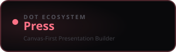

<div align="center">



<br /><br />

**Create stunning presentations with AI generation and real-time collaboration.**

<br />

   

<br /><br />

**Part of the [InfoDot Ecosystem](https://github.com/sakhileb/InfoDot)** &nbsp;·&nbsp; `press.infodot.app`

</div>

---

## What is Dot.Press?

Dot.Press is the presentation platform in the InfoDot ecosystem. A canvas-first editor lets teams build slide decks with pixel-perfect control; an AI generation layer can produce a full deck from a single prompt, and real-time collaboration keeps everyone in sync.

## Core Features

- Canvas editor — drag-and-drop text, shapes, images, and embeds
- AI deck generation — describe your presentation, get slides in seconds
- Real-time collaborative editing via Reverb
- Slide templates and design themes
- Speaker notes with presenter view
- One-click export to PDF and PPTX
- Share with viewers via public link
- Ecosystem SSO from InfoDot hub

## Domain Models

- **Presentation** — titled deck with settings
- **Slide** — individual canvas with layers
- **SlideElement** — positioned element (text, image, shape)
- **PresentationTheme** — reusable design config

## Tech Stack

| Layer | Technology |
|---|---|
| Framework | Laravel 12 |
| Language | PHP 8.4 |
| Frontend | Livewire 3 · Alpine.js 3 · Tailwind CSS |
| Database | PostgreSQL 16 (shared across ecosystem) |
| Realtime | Laravel Reverb |
| Auth | Laravel Sanctum (InfoDot SSO) |
| AI | Anthropic Claude (`claude-sonnet-4-6`) |
| Storage | AWS S3 / Local (Flysystem) |
| Search | Laravel Scout · Meilisearch |
| Queue | Redis · Laravel Horizon |

## Quick Start

```bash
git clone https://github.com/sakhileb/Dot.Press.git
cd Dot.Press
cp .env.example .env
composer install
npm install && npm run build
php artisan key:generate
php artisan migrate
php artisan serve
```

> **Ecosystem SSO:** Set `DB_*` env vars to the shared InfoDot PostgreSQL instance and `APP_URL=https://press.infodot.app`. Users authenticated through InfoDot gain access automatically via Sanctum handoff tokens.

## Ecosystem

**Dot.Press** is one of **21 platforms** in the InfoDot ecosystem, connected via shared PostgreSQL and Sanctum SSO. Visit [InfoDot](https://github.com/sakhileb/InfoDot) to explore the full platform map.

## License

MIT © [SK Digital / BluPin Incorporated](https://github.com/sakhileb)
